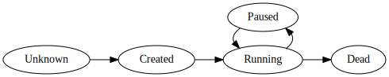

# Nanos6 model

The Nanos6 runtime library implements the OmpSs-2 tasking model, which
schedules the execution of tasks with dependencies. For more information
see the [OmpSs-2 website][oss] and the [Nanos6 repository][nanos6].

[oss]: https://pm.bsc.es/ompss-2
[nanos6]: https://github.com/bsc-pm/nanos6

The library is instrumented to track the execution of tasks and also the
execution path inside the runtime library to identify what is happening.
This information is typically used by both the users and the developers
of the Nanos6 library to analyze problems and unwanted behaviors.
Towards this goal, five different Paraver views are generated, which are
explained below.

The state of each task is modelled in a simple finite state machine,
which identifies the main state changes of the task. The task is set to
the *Running* state when it begins executing the body of the task,
consisting of user defined code. The states can be observed in the
following diagram:

A thread can only execute one task at a time, but multiple tasks can be
nested and only the topmost one will actually run. When a view presents
the running task of a thread, that one is always the top of the stack.

## Task ID view

The task ID view represents the numeric ID of the Nanos6 task that is
currently running on each thread. The ID is a monotonically increasing
identifier assigned on task creation. Lower IDs correspond to tasks
created at an earlier point than higher IDs.

## Task type view

Every task in Nanos6 contains a task type, which roughly corresponds to
the actual location in the code a task was declared. For example if a
function is declared as a Nanos6 task, and it is called multiple times
in a program, every created task will have a different ID, but the same
type.

In the view, each type is shown with a label declared in the source with
the label attribute of the running task. If no label was specified, one
is automatically generated for each type.

Note that in this view, the numeric event value is a hash function of
the type label, so two distinct types (tasks declared in different parts
of the code) with the same label will share the event value and have the
same color.

## MPI rank view

This view shows the numeric MPI rank of the process running the current
task. It is only shown when the task is in the running state. This view
is specially useful to identify task in a distributed workload, which
spans several nodes.

As the zero value in Paraver gets hidden, we use the rank+1 value
instead. Therefore the rank numeric value go from 1 to the number of
ranks (inclusive).

## Thread type view

This view shows the type of each thread:

- Main: the first thread executed before the main() function even
  begins.

- Leader: helps with the execution of the main().

- Worker: the most common threads, these are in charge of queueing
  and running tasks.

- External: used for external threads that attach to Nanos6 (currently
  there are not in use).

## Subsystem view

The subsystem view attempts to provide a general overview of what Nanos6
is doing at any point in time. This view is more complex to understand
than the others but is generally the most useful to understand what is
happening and debug problems related with Nanos6 itself.

The view shows the state of the runtime for each thread (and for each
CPU, the state of the running thread in that CPU).

The state is computed by the following method: the runtime code is
completely divided into sections of code (machine instructions) $`S_1,
S_2, \ldots, S_N`$, which are instrumented (an event is emitted when entering
and exiting each section), and one common section of code which is
shared across the subsystems, $`U`$, of no interest. We also assume any
other code not belonging to the runtime belongs to the $`U`$ section.

!!! remark

    Every instruction of the runtime belongs to *exactly one section*.

To determine the state of a thread, we look into the stack to see what
is the top-most instrumented section.

At any given point in time, a thread may be executing code with a stack
that spawns multiple sections, for example $`[ S_1, U, S_2, S_3, U ]`$
(the last is current stack frame). The subsystem view selects the last
subsystem section from the stack ignoring the common section $`U`$, and
presents that section as the current state of the execution, in this
case the section $`S_3`$.

Additionally, the runtime sections $`S_i`$ are grouped together in
subsystems, which form a closely related group of functions. When there is no
instrumented section in the thread stack, the state is set to **No subsystem**.
The complete list of subsystems and sections is shown below.

- **Task subsystem**: Controls the life cycle of tasks

    - **Running body**: Executing the body of the task (user defined code).
    
    - **Running task for**: Running the body of the task in a task for (one of
      the collaborators).

    - **Spawning function**: Spawning a function as task that will be submitted
      for later execution.
    
    - **Creating**: Creating a new task via `nanos6_create_task`
    
    - **Submitting**: Submitting a recently created task via
      `nanos6_submit_task`

- **Scheduler subsystem**: Queueing and dequeueing ready tasks.

    - **Serving tasks**: Inside the scheduler lock, serving tasks to
      other workers.

    - **Adding ready tasks**: Adding tasks to the scheduler queues, but
      outside of the scheduler lock.

    - **Processing ready tasks**: Moving tasks from the lock-free add
      queues to the scheduler queues.

- **Worker subsystem**: Actions that relate to worker threads, which
  continuously try to execute new tasks.

    - **Looking for work**: Actively requesting tasks from the scheduler,
      registered but not holding the lock.
    
    - **Handling task**: Processing a recently assigned task.

    - **Switching to another thread**: Switching to another thread via
      switchTo().

    - **Migrating CPU**: Changing the CPU of the current worker.

    - **Suspending thread**: The current thread is in the suspend()
      function.

    - **Resuming another thread**: Inside the resume() function,
      wakening another thread.

- **Memory**: Manages the allocation and deallocation of memory.

    - **Allocating**: Allocating new memory. This can take very long
      with jemalloc in the first calls from each thread.

    - **Freeing**: Deallocating memory.

- **Dependency subsystem**: Manages the registration of task
  dependencies.

    - **Registering**: Registering dependencies of a task
    
    - **Unregistering**: Releasing dependencies of a task because
    it has ended

- **Blocking subsystem**: Code that stops the thread execution.

    - **Taskwait**: Task is blocked due to a `taskwait` clause
    
    - **Blocking current task**: Task is blocked through the Nanos6
      blocking API
    
    - **Unblocking remote task**: Unblocking a different task using the
      Nanos6 blocking API
    
    - **Wait for deadline**: Blocking a deadline task, which will be
      re-enqueued when a certain amount of time has passed

!!! remark

    Notice that tasks in the running state will display the "Task: Running
    body" subsystem only when the task has not called any other instrumented
    subsystem in Nanos6. Tasks will continue to be in the running state until
    paused or finished.

## Limitations

The task for clause is partially supported, as currently the emulator uses a
simplified tasking model where a task can only be executed by one thread, and
only once. However, the Nanos6 runtime can run the body of a single task
multiple times by varying the arguments with the task for clause, which breaks
the emulation model.

The task for is currently only shown in the subsystem view, but it doesn't
appear as running any task in the other views.
