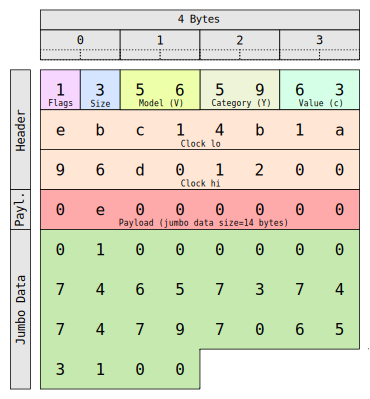

# Trace specification version 1

The ovni instrumentation library produces a trace with the following
specification.

The complete trace is stored in a top-level directory named "ovni".
Inside this directory you will find the loom directories with the prefix
`loom.`. The name of the loom is built from the `loom` parameter of
`ovni_proc_init()`, prefixing it with `loom.`.

Each loom directory contains one directory per process of that loom. The
name is composed of the `proc.` prefix and the PID of the process
specified in the `pid` argument to `ovni_proc_init()`.

Each process directory contains:

- The metadata file `metadata.json`.
- The thread traces with prefix `thread.`.

## Process metadata

The metadata file contains important information about the trace that is
invariant during the complete execution, and generally is required to be
available prior to processing the events in the trace.

The metadata is stored in the JSON file `metadata.json` inside each
process directory and contains the following keys:

- `version`: a number specifying the version of the metadata format.
- `app_id`: the application ID, used to distinguish between applications
  running on the same loom.
- `rank`: the rank of the MPI process (optional).
- `nranks`: number of total MPI processes (optional).
- `cpus`: the array of $`N_c`$ CPUs available in the loom. Only one
  process in the loom must contain this mandatory key. Each element is a
  dictionary with the keys:
  - `index`: containing the logical CPU index from 0 to $`N_c - 1`$.
  - `phyid`: the number of the CPU as given by the operating system
    (which can exceed $`N_c`$).

## Thread trace

The thread trace is a binary file composed of events joined one after
the other. Each event has a header with the following information:

- Event flags
- Payload size in a special format
- Model, category and value codes
- Time in nanoseconds
- Payload (optional)

The payload size is specified using 4 bits, with the value `0x0` for no
payload, or with value $`v`$ for $`v + 1`$ bytes of payload. This
allows us to use 16 bytes of payload with value `0xf` at the cost of
sacrificing payloads of one byte.

There are two types of events, depending of the size needed for the
payload:

- Normal: with a payload up to 16 bytes
- Jumbo: with a payload up to 2^32 bytes

## Normal events

The normal events are composed of:

- 4 bits of flags
- 4 bits of payload size
- 3 bytes for the MCV
- 8 bytes for the clock
- 0 to 16 bytes of payload

Here is an example of a normal event without payload, a total of 12
bytes:

```
% dd if=thread.552943 skip=5258 bs=1 | hexdump -C 
00000000  00 4f 48 65 01 c5 cf 1d  96 d0 12 00              |.OHe........|
```

And in the following figure you can see every field annotated: 


Another example of a normal event with 16 bytes of payload, a total of
28 bytes as reported by hexdump:

```
% dd if=thread.552943 bs=1 count=28 | hexdump -C
00000000  0f 4f 48 78 58 c1 b0 b5  95 43 11 00 00 00 00 00  |.OHxX....C......|
00000010  ff ff ff ff 00 00 00 00  00 00 00 00              |............|
```

In the following figure you can see each field annotated:


## Jumbo events

The jumbo events are just like normal events but they can hold large
data. The size of the jumbo data is stored as a 32 bits integer as a
normal payload, and the jumbo data just follows the event.

- 4 bits of flags
- 4 bits of payload size (always 4 with value 0x3)
- 3 bytes for the MCV
- 8 bytes for the clock
- 4 bytes of payload with the size of the jumbo data
- 0 to 2^32 bytes of jumbo data

Example of a jumbo event of 30 bytes in total, with 14 bytes of jumbo
data:

```
00000000  13 56 59 63 eb c1 4b 1a  96 d0 12 00 0e 00 00 00  |.VYc..K.........|
00000010  01 00 00 00 74 65 73 74  74 79 70 65 31 00        |....testtype1.|
```

In the following figure you can see each field annotated:



## Design considerations

The trace format has been designed to be very simple, so writing a
parser library would take no more than 2 days.

The common events don't use any payload, so the size per event is kept
at the minimum of 12 bytes.

**Important:** The events are stored in disk following the endianness of
the machine where they are generated. So a trace generated with a little
endian machine would be different than on a big endian machine. Using
the same endiannes avoids the cost of serialization when writting the
trace at runtime.

The events are designed to be easily identified when looking at the
raw trace in binary, as the MCV codes can be read as ASCII characters:

```
00000000  0f 4f 48 78 58 c1 b0 b5  95 43 11 00 00 00 00 00  |.OHxX....C......|
00000010  ff ff ff ff 00 00 00 00  00 00 00 00 00 36 53 72  |.............6Sr|
00000020  ab cb b0 b5 95 43 11 00  00 36 53 73 78 c3 b9 b5  |.....C...6Ssx...|
00000030  95 43 11 00 00 36 53 40  87 a4 c2 b5 95 43 11 00  |.C...6S@.....C..|
00000040  00 36 53 68 9c 4b cb b5  95 43 11 00 00 36 53 66  |.6Sh.K...C...6Sf|
00000050  85 44 d4 b5 95 43 11 00  00 36 53 5b cb e7 dc b5  |.D...C...6S[....|
00000060  95 43 11 00 00 36 53 5d  cf ca e5 b5 95 43 11 00  |.C...6S].....C..|
00000070  00 36 53 75 8c db ee b5  95 43 11 00 00 36 53 55  |.6Su.....C...6SU|
00000080  5a 70 f8 b5 95 43 11 00  00 36 55 5b 1b ae 01 b6  |Zp...C...6U[....|
00000090  95 43 11 00 00 36 55 5d  aa 19 0b b6 95 43 11 00  |.C...6U].....C..|
```

This allows a human to detect signs of corruption by just visually
inspecting the trace.

## Limitations

The traces are designed to be read only forward, as they only contain
the size of each event in the header.
