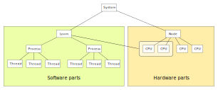

# Part model

Ovni has a model to represent the hardware components as well as the software
concepts like threads or processes. Each concept is considered to be a *part*.
Here is an example diagram depicting the part hierarchy:

Notice how a loom can restrict the CPUs of the node to its child processes.

## Software parts

These are not physical parts, but they abstract common concepts.

### Thread

A thread in ovni is directly mapped to a [POSIX
thread](https://en.wikipedia.org/wiki/Pthreads) and they are identified by a
`TID` which must be unique in a [node](#node). Threads in ovni have [a model with
an internal state](../emulation/ovni.md/#thread_model) that tries to tracks the
state of the real thread.

### Process

A process is directly mapped to a UNIX
[process](https://en.wikipedia.org/wiki/Process_(computing)) and they are
identified by a `PID` number which must be unique in a [node](#node).

### Loom

A loom has no direct mapping to a usual concept. It consists of a set of
[CPUs](#cpu) from the same node and a set of processes that can *only run in
those CPUs*. Each CPUs must belong to one and only one loom. It is often used
to group CPUs that belong to the same process when running workloads with
multiple processes (like with MPI).

Each loom has a virtual CPU which collects running threads that are not
exclusively assigned to a physical CPU, so we cannot determine on which CPU they
are running.

## Hardware parts

These parts have a physical object assigned.

### CPU

A CPU is a hardware thread that can execute at most one thread at a time. Each
CPU must have a physical ID that is unique in a node. In ovni there is also a
virtual CPU, which simply is used to collect threads that are not tied to an
specific physical CPU, so it cannot be easily determined where they are running.

### Node

A *node* refers to a compute node, often a physical machine with memory and
network which may contain one or more
[sockets](https://en.wikipedia.org/wiki/CPU_socket), where each socket has one
or more CPUs.

### System

A system represents the complete set of hardware parts and software parts that
are known to ovni in a given trace.
