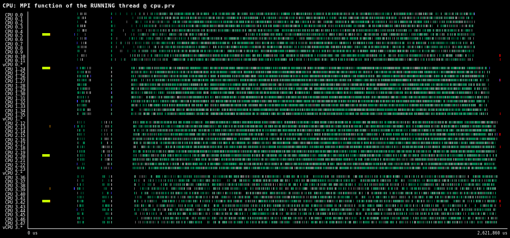

# MPI model

The [Message Passing Interface (MPI)][mpi] is a standard library interface
specification for message-passing communication libraries targeting parallel
computing architectures. The interface defines functions for point-to-point
communication primitives, collectives, remote memory access (RMA), I/O and
process management.

The [Sonar][sonar] library instruments the most essential MPI functions that any
user application or any external library may execute. Sonar tracks the calls to
these MPI functions made at each point. Both users and developers can use this
information to analyze the time spent inside MPI functions. The next section
explains a view that is provided to achieve this goal.

The Sonar library is compatible with the MPI standards 3.0, 3.1 and 4.0. See the
[MPI documentation][mpi docs] for more information about the MPI standards and
their functions.

[mpi]: https://www.mpi-forum.org
[mpi docs]: https://www.mpi-forum.org/docs
[sonar]: https://pm.bsc.es/gitlab/ovni/sonar
[sonar docs]: https://pm.bsc.es/gitlab/ovni/sonar/-/blob/main/README.md

Sonar requires an installation of the ovni library and an MPI library. Use the
option `--with-ovni=prefix` when building Sonar to specify the ovni prefix. The
building procedure will compile and install the `libsonar-mpi.so`. See the
[Sonar documentation][sonar docs] for more details about the building steps.

An application can instrument the MPI function calls by linking with the Sonar
library `libsonar-mpi.so`. At run-time, the Sonar library does not enable the
instrumentation by default. Sonar instruments the MPI functions when the
environment variable `SONAR_MPI_INSTRUMENT` is defined to `ovni`. Its default
value is `none`.

As an example, a user can generate a trace with MPI function events of an MPI
program `app.c` in this way:

```
$ mpicc -c app.c -o app.o
$ mpicc app.o -o app -L${SONAR_PREFIX}/lib -lsonar-mpi
$ export SONAR_MPI_INSTRUMENT=ovni
$ mpirun -n 2 ./app
```

This will generate an ovni trace in the `ovni` directory, which can be emulated
using the `ovniemu` tool.

!!! Note

    Notice that the order of libraries at the linking stage is important. The
    Sonar library should always have precedence on the MPI library. That's the
    usual behavior when using `mpicc` tools. The `mpicc` tool should link the
    application with the MPI libraries as the last libraries in the list of
    application's dependencies. If this order is not respected, the Sonar
    library would not be able to intercept the MPI function calls and instrument
    them.

!!! Note

    Notice the Task-Aware MPI (TAMPI), as well as other external libraries,
    intercepts the MPI functions and may call MPI functions instead. Thus, the
    order in which such libraries and Sonar are linked to the application will
    also alter the resulting ovni trace. Give precedence to the Sonar library to
    instrument the MPI function calls made by the application. You can achieve
    by linking your application with the linking options `-lsonar-mpi -ltampi`.
    Otherwise, give precendence to the TAMPI library to track the real MPI
    functions that are being executed (i.e., the ones that the MPI library
    actually runs). In this case, use the linking options `-ltampi -lsonar-mpi`.

## Function view

The function view attempts to provide a general overview of which are the MPI
functions being executed at any point in time. The function view shows the MPI
functions called by each thread (and for each CPU, the MPI functions executed
by the running thread in that CPU).

The function states shown in this view are listed below. Each function state
(in bold) includes a list of all the MPI functions that are instrumented as
that particular state. Notice that only the most important functions are
instrumented. Also, notice that not all functions have their own state. For
instance, the large count MPI (with `_c` suffix) introduced in MPI 4.0, the
extended functions (with `v` or `w` suffix), and Fortran functions (with lower
case name and `_` suffix) are instrumented as their simple C function without
suffix.

- *Setup functions*: The running thread is executing MPI setup functions to
  initialize and finalize the MPI environment. The following function states
  are shown:

    - **MPI_Init**: `MPI_Init`, `mpi_init_`

    - **MPI_Init_thread**: `MPI_Init_thread`, `mpi_init_thread_`

    - **MPI_Finalize**: `MPI_Finalize`, `mpi_finalize_`

- *Request functions*: The running thread is executing MPI functions that wait
  or test MPI requests after being generated by non-blocking MPI operations. The
  following functions are instrumented:

    - **MPI_Wait**: `MPI_Wait`, `mpi_wait_`

    - **MPI_Waitall**: `MPI_Waitall`, `mpi_waitall_`

    - **MPI_Waitany**: `MPI_Waitany`, `mpi_waitany_`

    - **MPI_Waitsome**: `MPI_Waitsome`, `mpi_waitsome_`

    - **MPI_Test**: `MPI_Test`, `mpi_test_`

    - **MPI_Testall**: `MPI_Testall`, `mpi_testall_`

    - **MPI_Testany**: `MPI_Testany`, `mpi_testany_`

    - **MPI_Testsome**: `MPI_Testsome`, `mpi_testsome_`

- *Point-to-point functions*: The running thread is communicating through MPI
  by executing point-to-point primitives. The instrumented functions are:

    - **MPI_Recv**: `MPI_Recv`, `MPI_Recv_c`, `mpi_recv_`

    - **MPI_Send**: `MPI_Send`, `MPI_Send_c`, `mpi_send_`

    - **MPI_Bsend**: `MPI_Bsend`, `MPI_Bsend_c`, `mpi_bsend_`

    - **MPI_Rsend**: `MPI_Rsend`, `MPI_Rsend_c`, `mpi_rsend_`

    - **MPI_Ssend**: `MPI_Ssend`, `MPI_Ssend_c`, `mpi_ssend_`

    - **MPI_Sendrecv**: `MPI_Sendrecv`, `MPI_Sendrecv_c`, `mpi_sendrecv_`

    - **MPI_Sendrecv_replace**: `MPI_Sendrecv_replace`, `MPI_Sendrecv_replace_c`,
      `mpi_sendrecv_replace_`

    - **MPI_Irecv**: `MPI_Irecv`, `MPI_Irecv_c`, `mpi_irecv_`

    - **MPI_Isend**: `MPI_Isend`, `MPI_Isend_c`, `mpi_isend_`

    - **MPI_Ibsend**: `MPI_Ibsend`, `MPI_Ibsend_c`, `mpi_ibsend_`

    - **MPI_Irsend**: `MPI_Irsend`, `MPI_Irsend_c`, `mpi_irsend_`

    - **MPI_Issend**: `MPI_Issend`, `MPI_Issend_c`, `mpi_issend_`

    - **MPI_Isendrecv**: `MPI_Isendrecv`, `MPI_Isendrecv_c`, `mpi_isendrecv_`

    - **MPI_Isendrecv_replace**: `MPI_Isendrecv_replace`,
      `MPI_Isendrecv_replace_c`, `mpi_isendrecv_replace_`

- *Collective functions*: The running thread is communicating through MPI by
  executing collective functions. The instrumented functions are:

    - **MPI_Gather**: `MPI_Gather`, `MPI_Gatherv`, `MPI_Gather_c`,
      `MPI_Gatherv_c`, `mpi_gather_`, `mpi_gatherv_`

    - **MPI_Allgather**: `MPI_Allgather`, `MPI_Allgatherv`, `MPI_Allgather_c`,
      `MPI_Allgatherv_c`, `mpi_allgather_`, `mpi_allgatherv_`

    - **MPI_Scatter**: `MPI_Scatter`, `MPI_Scatterv`, `MPI_Scatter_c`,
      `MPI_Scatterv_c`, `mpi_scatter_`, `mpi_scatterv_`

    - **MPI_Reduce**: `MPI_Reduce`, `MPI_Reduce_c`, `mpi_reduce_`

    - **MPI_Reduce_scatter**: `MPI_Reduce_scatter`, `MPI_Reduce_scatter_c`,
      `mpi_reduce_scatter_`

    - **MPI_Reduce_scatter_block**: `MPI_Reduce_scatter_block`,
      `MPI_Reduce_scatter_block_c`, `mpi_reduce_scatter_block_`

    - **MPI_Allreduce**: `MPI_Allreduce`, `MPI_Allreduce_c`, `mpi_allreduce_`

    - **MPI_Barrier**: `MPI_Barrier`, `MPI_Barrier_c`, `mpi_barrier_`

    - **MPI_Bcast**: `MPI_Bcast`, `MPI_Bcast_c`, `mpi_bcast`

    - **MPI_Alltoall**: `MPI_Alltoall`, `MPI_Alltoallv`, `MPI_Alltoallw`,
      `MPI_Alltoall_c`, `MPI_Alltoallv_c`, `MPI_Alltoallw_c`, `mpi_alltoall_`,
      `mpi_alltoallv_`, `mpi_alltoallw_`

    - **MPI_Scan**: `MPI_Scan`, `MPI_Scan_c`, `mpi_scan_`

    - **MPI_Exscan**: `MPI_Exscan`, `MPI_Exscan_c`, `mpi_exscan_`

    - **MPI_Igather**: `MPI_Igather`, `MPI_Igatherv`, `MPI_Igather_c`,
      `MPI_Igatherv_c`, `mpi_igather_`, `mpi_igatherv_`

    - **MPI_Iallgather**: `MPI_Iallgather`, `MPI_Iallgatherv`,
      `MPI_Iallgather_c`, `MPI_Iallgatherv_c`, `mpi_iallgather_`,
      `mpi_iallgatherv_`

    - **MPI_Iscatter**: `MPI_Iscatter`, `MPI_Iscatterv`, `MPI_Iscatter_c`,
      `MPI_Iscatterv_c`, `mpi_iscatter_`, `mpi_iscatterv_`

    - **MPI_Ireduce**: `MPI_Ireduce`, `MPI_Ireduce_c`, `mpi_ireduce_`

    - **MPI_Iallreduce**: `MPI_Iallreduce`, `MPI_Iallreduce_c`, `mpi_iallreduce_`

    - **MPI_Ireduce_scatter**: `MPI_Ireduce_scatter`, `MPI_Ireduce_scatter_c`,
      `mpi_ireduce_scatter_`

    - **MPI_Ireduce_scatter_block**: `MPI_Ireduce_scatter_block`,
      `MPI_Ireduce_scatter_block_c`, `mpi_ireduce_scatter_block_`

    - **MPI_Ibarrier**: `MPI_Ibarrier`, `MPI_Ibarrier_c`, `mpi_ibarrier_`

    - **MPI_Ibcast**: `MPI_Ibcast`, `MPI_Ibcast_c`, `mpi_ibcast_`

    - **MPI_Ialltoall**: `MPI_Ialltoall`, `MPI_Ialltoallv`, `MPI_Ialltoallw`,
      `MPI_Ialltoall_c`, `MPI_Ialltoallv_c`, `MPI_Ialltoallw_c`,
      `mpi_ialltoall_`, `mpi_ialltoallv_`, `mpi_ialltoallw_`

    - **MPI_Iscan**: `MPI_Iscan`, `MPI_Iscan_c`, `mpi_iscan_`

    - **MPI_Iexscan**: `MPI_Iexscan`, `MPI_Iexscan_c`, `mpi_iexscan_`

!!! Note

    The Sonar library does not support large count MPI functions for the Fortran
    language yet, and thus, these functions are not instrumented.

The figure below shows an example of the MPI function view. The program executes
a distributed stencil algorithm with MPI and OmpSs-2. There are several MPI
processes, each running OmpSs-2 tasks on an exclusive set of CPUs. Most of these
are computation tasks, while the others are concurrent tasks performing
communications using the blocking mode of the TAMPI library. These use `MPI_Send`
and `MPI_Recv` functions to send and receive blocks of data. The program was
linked with Sonar and preceding the TAMPI library. Thus, the trace shows the
blocking MPI function calls made by the application.



The light green areas correspond to the `MPI_Init_thread` calls, the grey ones
are `MPI_Send` calls and the dark green areas are `MPI_Recv` calls. There are
other secondary calls like `MPI_Bcast` (orange), `MPI_Barrier` (blue) and
`MPI_Finalize` (red) calls.

As mentioned above, the trace shows the blocking MPI functions called by the
application because Sonar was placed before TAMPI in the linking order. However,
these blocking calls may not be actually executed by the MPI library; TAMPI will
transparently replace them with non-blocking calls (e.g., `MPI_Isend` and
`MPI_Irecv`) and a polling mechanism for the generated MPI requests. If you want
to explore the actual MPI functions being executed, you should link the Sonar
library after TAMPI.
