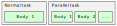
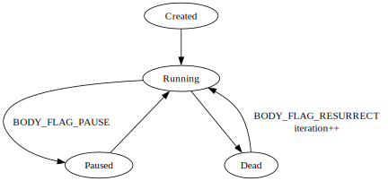
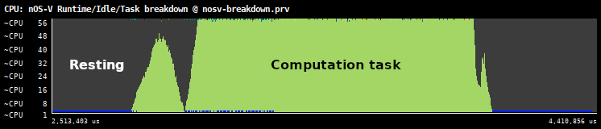

# nOS-V model

The [nOS-V library][nosv] implements a user space runtime that can schedule
tasks to run in multiple CPUs. The nOS-V library is instrumented to
track the internal state of the runtime as well as emit information
about the tasks that are running.

[nosv]: https://github.com/bsc-pm/nos-v

## Task model

The nOS-V runtime is composed of tasks that can be scheduled to run in
threads. Tasks can be paused and resumed, leaving the CPUs free to
execute other tasks.

In nOS-V, parallel tasks can also be scheduled multiple times and the
same task may run concurrently in several CPUs. To model this scenario,
we introduce the concept of *body*, which maps to each execution of the
same task, with a unique body id.



A normal task only has one body, while a parallel task (created with
`TASK_FLAG_PARALLEL`) can have more than one body. Each body holds the
execution state, and can transition to different execution states
following this state diagram:



Bodies begin in the Created state and transition to Running when they
begin the execution. Bodies that can be paused (created with the flag
`BODY_FLAG_PAUSE` can transition to the Paused state.

Additionally, bodies can run multiple times if they are created with the
`BODY_FLAG_RESURRECT`, and transition from Dead to Running. This
transition is required to model the tasks that implement the taskiter in
NODES, which will be submitted multiple times for execution reusing the
same task id and body id. Every time a body runs again, the iteration
number is increased.

## Task type colors

In the Paraver timeline, the color assigned to each nOS-V task type is
computed from the task type label using a hash function; the task type
id doesn't affect in any way how the color gets assigned. This method
provides two desirable properties:

- Invariant type colors over time: the order in which task types are
  created doesn't affect their color.

- Deterministic colors among threads: task types with the same label end
  up mapped to the same color, even if they are from different threads
  located in different nodes.

For more details, see [this MR][1].

[1]: https://pm.bsc.es/gitlab/rarias/ovni/-/merge_requests/27

## Subsystem view

The subsystem view provides a simplified view on what is the nOS-V
runtime doing over time. The view follows the same rules described in
the [subsystem view of Nanos6](nanos6.md/#subsystem_view).


## Idle view

The idle view shows the progress state of the running threads:
*Progressing* and *Resting*. The *Progressing* state is shown when they
are making useful progress and the *Resting* state when they are waiting
for work. When workers start running, by definition, they begin in the
Progressing state and there are some situations that make them
transition to Resting:

- When workers are waiting in the delegation lock after some spins or
  when instructed to go to sleep.
- When the server is trying to serve tasks, but there are no more tasks
  available.

They will go back to Progressing as soon as they receive work. The
specific points at which they do so can be read in [nOS-V source
code](https://gitlab.bsc.es/nos-v/nos-v) by looking at the
`instr_worker_resting()` and `instr_worker_progressing()` trace points.

This view is intended to detect parts of the execution time on which the
workers don't have work, typically because the application doesn't have
enough parallelism or the scheduler is unable to serve work fast enough.

## Breakdown view

The breakdown view displays a summary of what is happening in all CPUs
by mixing in a single timeline the subsystem, idle and task type views.
Specifically, it shows how many CPUs are resting as defined by the idle
view, how many are inside a given task by showing the task type label,
and how many are in a particular subsystem of the runtime.

!!! Important

    You must specify *ovni.level = 3* or higher in *nosv.toml* and pass
    the *-b* option to ovniemu to generate the breakdown view.

Notice that the vertical axis shows the **number**
of CPUs in that state, not the physical CPUs like other views.
Here is an example of the Heat mini-app:



## Hardware counters (HWC) view

The hardware counter view allows you to see the *delta* of a given set of
hardware counters over time. The counters are read at the beginning and end of
tasks as well as at some nOS-V API methods.

To enable support for HWC in nOS-V use at least level 2 in `ovni.level` or
enable the "hwc" event set in nosv.toml. Then, make sure the
`hwcounters.backend` option is set to "papi" and select the counters you want to
enable in `hwcounters.papi_events`. Here is an example to trace total
instructions and cycles:

```
instrumentation.version = "ovni"
ovni.level = 2
hwcounters.backend = "papi"
hwcounters.papi_events = [ "PAPI_TOT_INS", "PAPI_TOT_CYC" ]
```

You can use the `papi_avail` tool to see which counters are available for a
particular machine and a description of each counter. Each CPU has a limit in
how many counters can be enabled at the same time, reported in the *Number
Hardware Counters* line.

The events for HWC are generated in cpu.prv and thread.prv for CPUs and threads,
respectively. For each enabled hardware counter, a new configuration file will
be created at `cfg/cpu/nosv/hwc-*.cfg` and `cfg/thread/nosv/hwc-*.cfg` with the
corresponding name of the counter.
