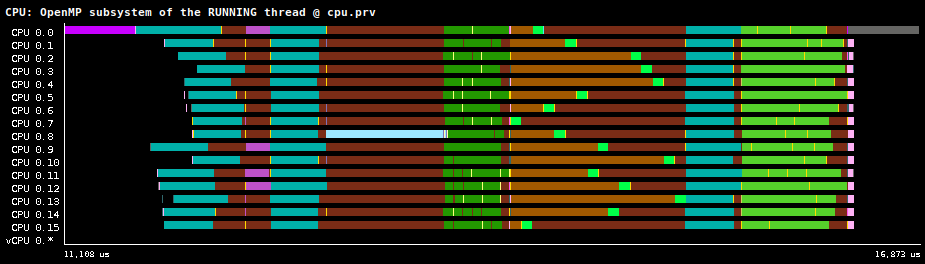

# OpenMP model

The [OpenMP programming model](https://www.openmp.org) is a widely used API and
set of directives for parallel programming, allowing developers to write
multi-threaded and multi-process applications more easily. In this document we
refer to the
[version 5.2 of the OpenMP specification](https://www.openmp.org/wp-content/uploads/OpenMP-API-Specification-5-2.pdf).

The [LLVM OpenMP Runtime](https://openmp.llvm.org/design/Runtimes.html) provides
an implementation of the OpenMP specification as a component of the LLVM
compiler infrastructure. We have modified the LLVM OpenMP runtime (libomp) to run on top
of the [nOS-V](https://gitlab.bsc.es/nos-v/nos-v) runtime as part of the
[OmpSs-2 LLVM compiler](https://pm.bsc.es/llvm-ompss), named **libompv**.

We have added instrumentation events to libompv designed to be enabled along
the [nOS-V instrumentation](nosv.md). This document describes all the
instrumentation features included in our modified libompv runtime to identify
what is happening. This data is useful for both users and developers of the
OpenMP runtime to analyze issues and undesired behaviors.

!!! Note

    Instrumenting libomp is planned but is not yet posible.
    For now you must use libompv.

## Enable the instrumentation

To generate runtime traces, you will have to:

1. **Build nOS-V with ovni support:** Refer to the
  [nOS-V
  documentation](https://github.com/bsc-pm/nos-v/blob/master/docs/user/tracing.md).
  Typically you should use the `--with-ovni` option at configure time to specify
  where ovni is installed.
2. **Build libompv with ovni and nOS-V support:** Use the `PKG_CONFIG_PATH`
  environment variable to specify the nOS-V and ovni installation 
  when configuring CMake.
3. **Enable the instrumentation in nOS-V at runtime:** Refer to the
  [nOS-V documentation](https://github.com/bsc-pm/nos-v/blob/master/docs/user/tracing.md)
  to find out how to enable the tracing at runtime. Typically you can just set 
  `NOSV_CONFIG_OVERRIDE="instrumentation.version=ovni"`.
4. **Enable the instrumentation of libompv at runtime:** Set the environment
  variable `OMP_OVNI=1`.

Next sections describe each of the views included for analysis.

## Subsystem view



The view is complemented with the information of [nOS-V views](nosv.md),
as libompv uses nOS-V tasks to run the workers.
Subsystem illustrates the activities of each thread with different states:

- **Work-distribution subsystem**: Related to work-distribution constructs,
    [in Chapter 11][workdis].

    - **Distribute**: Running a *Distribute* region.

    - **Dynamic for chunk**: Running a chunk of a dynamic *for*, which often
      involve running more than one iteration of the loop. See the
      [limitations](#dynamic_for) below.

    - **Dynamic for initialization**: Preparing a dynamic *for*.

    - **Static for chunk**: Executing the assigned iterations of an static
      *for*.

    - **Single**: Running a *Single* region. All threads of the parallel region
      participate.

    - **Section**: Running a *Section* region. All threads of the parallel region
      participate.

- **Task subsystem**: Related to tasking constructs, [in Chapter 12][tasking].

    - **Allocation**: Allocating the task descriptor.

    - **Check deps**: Checking if the task has pending dependencies to be
      fulfilled. When all dependencies are fulfilled the task will be scheduled.

    - **Duplicating**: Duplicating the task descriptor in a taskloop.

    - **Releasing deps**: Releasing dependencies at the end of a task. This
      state is always present even if the task has no dependencies.

    - **Running task**: Executing a task.

    - **Running task if0**: Executing a task if0.

    - **Scheduling**: Adding the task to the scheduler for execution.

    - **Taskgroup**: Waiting in a *taskgroup* construct.

    - **Taskwait**: Waiting in a *taskwait* construct.

    - **Taskwait deps**: Trying to execute tasks until dependencies have been
      fulfilled. This appears typically in a task if0 with dependencies or a
      taskwait with deps.
    
    - **Taskyield**: Performing a *taskyield* construct.

- **Critical subsystem**: Related to the *critical* Constuct, in [Section 15.2][critical].

    - **Acquiring**: Waiting to acquire a *Critical* section.

    - **Section**: Running the *Critical* section.

    - **Releasing**: Waiting to release a *Critical* section.

- **Barrier subsystem**: Related to barriers, in [Section 15.3][barrier].
    **All barriers can try to execute tasks**.

    - **Barrier: Fork**: Workers wait for a release signal from the master thread to
      continue. The master can continue as soon as it signals the workers. It is
      done at the beginning of a fork-join region.

    - **Barrier: Join**: The master thread waits until all workers finish their work.
      Workers can continue as soon as they signal the master. It is done at the
      end of a fork-join region.
  
    - **Barrier: Plain**: Performing a plain barrier, which waits for a release
      signal from the master thread to continue. It is done at the beginning of
      a fork-join region, in the `__kmp_join_barrier()` function.

    - **Barrier: Task**: Blocked in an additional tasking barrier *until all previous
      tasks have been executed*. Only happens when executed with `KMP_TASKING=1`.

- **Runtime subsystem**: Internal operations of the runtime.

    - **Attached**: Present after the call to `nosv_attach()` and before
      `nosv_detach()`. This state is a hack.

    - **Fork call**: Preparing a parallel section using the fork-join model.
      Only called from the master thread.

    - **Init**: Initializing the libompv runtime.

    - **Internal microtask**: Running a internal libompv function as a microtask.

    - **User microtask**: Running user code as a microtask in a worker thread.

    - **Worker main Loop**: Running the main loop, where the workers run the
      fork barrier, run a microtask and perform a join barrier until there is no
      more work.

!!! Note

    The generated HTML version of the OpenMP 5.2 specification has some parts
    missing, so we link directly to the PDF file which may not work in some
    browsers.

[workdis]:  https://www.openmp.org/wp-content/uploads/OpenMP-API-Specification-5-2.pdf#chapter.11
[tasking]:  https://www.openmp.org/wp-content/uploads/OpenMP-API-Specification-5-2.pdf#chapter.12
[critical]: https://www.openmp.org/wp-content/uploads/OpenMP-API-Specification-5-2.pdf#section.15.2
[barrier]:  https://www.openmp.org/wp-content/uploads/OpenMP-API-Specification-5-2.pdf#section.15.3

## Label view

The label view displays the text in the `label()` clause of OpenMP
tasks and work distribution constructs (static and dynamic for, single
and section). When the label is not provided, the source file and source
line location is used instead.

When nesting multiple tasks or work distribution constructs, only the
innermost label is shown.

Note that in this view, the numeric event value is a hash function of
the type label, so two distinct tasks (declared in different parts of
the code) with the same label will share the event value and have the
same color.

## Task ID view

The task ID view represents the numeric ID of the OpenMP task that is
currently running on each thread. The ID is a monotonically increasing
identifier assigned on task creation. Lower IDs correspond to tasks
created at an earlier point than higher IDs.

# Breakdown (simple)

A simplified view for the breakdown is generated when the emulator is run with
the `-b` flag, the trace is stored in `openmp-breakdown.prv`. This breakdown
view selects the label when it has a value or the subsystem otherwise. The view
is sorted so that rows with same values are grouped together.

Notice that unlike nOS-V or Nanos6, we don't include yet the information about
the runtime waiting or making progress, but some information can be inferred
from the subsystem states.

## Limitations

As the compiler generates the code that perform the calls to the libompv
runtime, there are some parts of the execution that are complicated to
instrument by just placing a pair of events to delimite a function.

For those cases we use an approximation which is documented in the following
subsections.

### Dynamic for

The generated code of a *dynamic for* has the following structure:

```c
__kmpc_dispatch_init_4(...);
while (__kmpc_dispatch_next_4(...)) {
    for (i = ...; i <= ...; i++) {
        // User code ...
    }
}
```

The function `__kmpc_dispatch_next_4()` returns `true` if there are more
chunks (group of iterations) to be executed by the thread, otherwise it returns
`false`.

Ideally we want to instrument each chunk with a pair of begin and end events.

The problem with the instrumentation is that there is no easy way of determining
if the call to `__kmpc_dispatch_next_4()` is processing the first chunk, just
after `__kmpc_dispatch_init_4()`, or is coming from other chunks due to the
while loop.

Therefore, from the `__kmpc_dispatch_next_4()` alone, we cannot determine if we
need to only emit a single "begin a new chunk" event or we need to emit the pair
of events "finish the last chunk" and "begin a new one".

So, as a workaround, we emit an event from the end of `__kmpc_dispatch_init_4()`
starting a new chunk (which is fake), and then from `__kmpc_dispatch_next_4()` we
always emit the "finish the last chunk" and "begin a new one" events (unless
there are no more chunks, in which case we don't emit the "begin a new one"
event).

This will cause an spurious *Work-distribution: Dynamic for chunk* state at the
beginning of each dynamic for, which should be very short and is not really a
chunk.

### Static for

The generated code of an *static for* has the following structure:

```c
__kmpc_for_static_init_4(...);
for (i = ...; i <= ...; i++) {
    // User code ...
}
__kmpc_for_static_fini(...);
```

As this code is generated by the compiler we cannot easily add the begin/end
pair of events to mark the *Work-distribution: Static for chunk* state.

We assume that by placing the "begin processing a chunk" event at the end of
`__kmpc_for_static_init_4()` and the "end processing the chunk" event at
the beginning of `__kmpc_for_static_fini()` is equivalent to adding the
events surrounding the for loop.

### Task if0

The generated code of an *if0 task* has the following structure:

```c
... = __kmpc_omp_task_alloc(...);
__kmpc_omp_taskwait_deps_51(...); // If task has dependencies
__kmpc_omp_task_begin_if0(...);
// Call to the user code
omp_task_entry_(...);
__kmpc_omp_task_complete_if0(...);
```

Instead of injecting the begin and end events in the user code, we
approximate it by placing the "begin if0 task" event at the end of the
`__kmpc_omp_task_begin_if0` function and the "end if0 task" event at the
beginning of `__kmpc_omp_task_complete_if0`. This state will be shown as 
*Task: Running task if0*.
