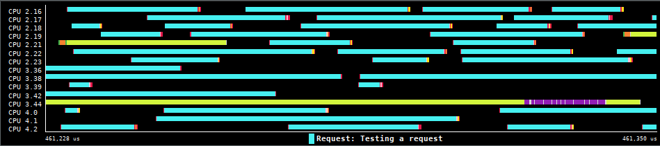

# TAMPI model

The Task-Aware MPI (TAMPI) library extends the functionality of standard MPI
libraries by providing new mechanisms for improving the interoperability between
parallel task-based programming models, such as OpenMP and OmpSs-2, and MPI
communications. This library allows the safe and efficient execution of MPI
operations from concurrent tasks and guarantees the transparent management and
progress of these communications.

[tampi repo]: https://github.com/bsc-pm/tampi
[tampi docs]: https://github.com/bsc-pm/tampi#readme
[tampi blk]: https://github.com/bsc-pm/tampi#blocking-mode-ompss-2
[tampi nonblk]: https://github.com/bsc-pm/tampi#non-blocking-mode-openmp--ompss-2

The TAMPI library has instrumented the execution of its task-aware functions
with ovni. To obtain an instrumented library, TAMPI must be built passing the
`--with-ovni` configure option and specifying the ovni installation prefix. At
run-time, the user can enable the instrumentation by defining the environment
variable `TAMPI_INSTRUMENT=ovni`.

For more information regarding TAMPI or how to enable its instrumentation see
the TAMPI [repository][tampi repo] and [documentation][tampi docs].

TAMPI is instrumented to track the execution path inside the run-time library
to identify what is happening at each moment. This information can be used by
both users and developers to analyze problems or to better understand the
execution behavior of TAMPI communications and its background services. There is
one view generated to achieve this goal.

## Subsystem view

The subsystem view attempts to provide a general overview of what TAMPI is doing
at any point in time. The view shows the state inside the TAMPI library for each
thread (and for each CPU, the state of the running thread in that CPU). This
subsystem state view sticks to the definition of subsystem states from the
[Nanos6](nanos6.md#subsystem_view).

The states shown in this view are:

- **Library code subsystem**: Indicating whether the running thread is executing
  effective TAMPI library code. These subsystem states wrap the rest of
  subsystems that are described below. No other TAMPI state can appear outside
  of a TAMPI library code subsystem state.

    - **Interface function**: Running any TAMPI API function or an intercepted
      MPI function which requires task-awareness. When the user application
      disables a TAMPI mode, whether the [blocking][tampi blk] or
      [non-blocking][tampi nonblk] mode, any call to an interface function
      corresponding to the disabled mode will not appear in the view. Operations
      that are directly forwarded to MPI (because TAMPI is not asked to apply
      task-awareness) will not appear.

    - **Polling function**: The TAMPI library can launch internal tasks to
      execute polling functions in the background. Currently, TAMPI launches a
      polling task that periodically checks and processes the pending MPI
      requests generated by task-aware operations. This polling state may not
      appear if none of the TAMPI modes are enabled by the user application.

- **Communication subsystem**: The running thread is communicating through MPI
  or issuing an asynchronous communication operation.

  - **Issuing a non-blocking operation**: Issuing a non-blocking MPI operation
    that can generate an MPI request.

- **Ticket subsystem**: Creation and managing of tickets. A ticket is an
  internal object that describes the relation between a set of pending MPI
  requests and the user communication task that is *waiting* (synchronous or
  asynchronously) on them. A ticket is used for both [blocking][tampi blk] and
  [non-blocking][tampi nonblk] operations.

    - **Creating a ticket**: Creating a ticket that is linked to a set of MPI
      requests and a user task. The user task is the task that is *waiting* for
      these requests to complete. Notice that *waiting* does not mean that the
      task will synchronously wait for them. The ticket is initialized with a
      counter of how many requests are still pending. The ticket is completed,
      and thus, the task is notified, when this counter becomes zero.

    - **Waiting for the ticket completion**: The user task, during a blocking
      TAMPI operation, is waiting a ticket and its requests to complete. The
      task may be blocked and yield the CPU meanwhile. Notice that user tasks
      calling non-blocking TAMPI operations will not enter in this state.

- **Staging queue subsystem**: Queueing and dequeueing requests from the staging
  queues before being transferred to the global array of requests and tickets.
  These queues are used to optimize and control insertion of these objects into
  the global array.

    - **Adding to a queue**: A user communication task running a task-aware
      TAMPI operation is pushing the corresponding MPI requests and the related
      ticket into a staging queue.

    - **Transfering from queues to the global array**: The polling task is
      transferring the staged requests and tickets from the queues to the global
      array.

- **Global array subsystem**: Managing the per-process global array of tickets
  and MPI requests related to TAMPI operations.

    - **Checking pending requests**: Testing all pending MPI requests from the
      global array, processing the completed requests, and reorganizing the
      array to keep it compacted.

- **Request subsystem**: Management and testing of pending MPI requests, and
  processing the completed ones. This state considers only the management of MPI
  requests concerning task-aware operations, which are exclusively tested by the
  TAMPI library. Any testing function call made by the user application or other
  libraries is not considered.

    - **Testing a request with MPI_Test**: Testing a single MPI request by
      calling MPI_Test inside the TAMPI library.

    - **Testing requests with MPI_Testall**: Testing multiple MPI requests by
      calling MPI_Testall inside the TAMPI library.

    - **Testing requests with MPI_Testsome**: Testing multiple MPI requests by
      calling MPI_Testsome inside the TAMPI library.

    - **Processing a completed request**: Processing a completed MPI request by
      decreasing the number of pending requests of the linked ticket. If the
      ticket does not have any other request to wait, the ticket is completed
      and the *waiting* task is notified. In such a case, a call to the tasking
      runtime system will occur. If the operation was [blocking][tampi blk], the
      *waiting* task will be unblocked and will eventually resume the execution.
      If the operation was [non-blocking][tampi nonblk], the library will
      decrease the external events of the *waiting* task.

The figure below shows an example of the subsystem view. The program executes a
distributed stencil algorithm with MPI and OmpSs-2. There are several MPI
processes and each process has OmpSs-2 tasks running exlusively on multiple CPU
resources.

The view show there are several user tasks running task-aware communication
operations. The light blue areas show when a user task is testing a request that
was generated by a non-blocking MPI communication function. There is also one
polling task per process. The yellow areas show when the polling tasks are
calling MPI_Testsome. Just after the testsome call, the violet areas show the
moment when the polling task is processing the completed requests.

This view shows that most of the time inside the TAMPI library is spent testing
requests. This could give us a clue that the underlying MPI library may have
concurrency issues (e.g., thread contention) when multiple threads try to test
requests in parallel.
